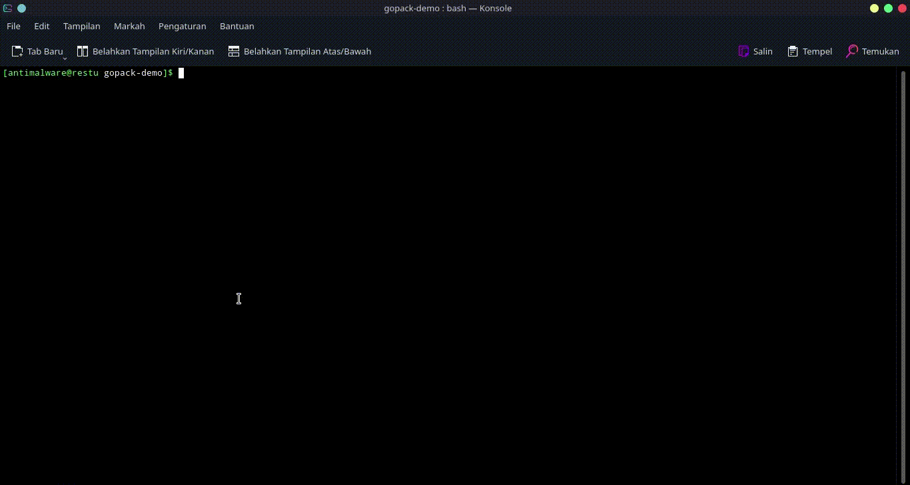

# Gopack CLI

[](https://travis-ci.com/restuwahyu13/gopack-cli) [](https://www.codefactor.io/repository/github/restuwahyu13/gopack-cli) [](https://codebeat.co/projects/github-com-restuwahyu13-gopack-main) [](https://www.codacy.com/gh/restuwahyu13/gopack-cli/dashboard?utm_source=github.com&amp;utm_medium=referral&amp;utm_content=restuwahyu13/gopack-cli&amp;utm_campaign=Badge_Grade)    [](https://packagephobia.com/result?p=gopack-cli)  [](https://github.com/restuwahyu13/gopack/blob/main/CONTRIBUTING.md)

**Gopack CLI** is instant package downloader for Go Programming, if you use **Gopack CLI** you can download your favorite package library with very easy, just play the keyboard and select the package you need, wait a while until your package is installed and **Gopack CLI** also supports installing multiple modules at the same time.

- [Gopack CLI](#gopack-cli)
  - [Installation](#installation)
  - [Feature](#feature)
  - [Command](#command)
  - [Example Usage](#example-usage)
  - [Noted](#noted)
  - [Testing](#testing)
  - [Bugs](#bugs)
  - [Contributing](#contributing)
  - [License](#license)

## Installation

```bash
$ npm install gopack-cli -g or yarn add gopack-cli -g
```

## Feature

- [x] Easy to use
- [x] Instant initialize `go.mod`
- [x] Support installed multiple Go module up to 50x package library at the same time
- [x] Support installed new differen Go module, after installation Go module previous success up to more than 10x

## Command
```sh
 .88888.                                      dP
d8'   `88                                     88
88        .d8888b. 88d888b. .d8888b. .d8888b. 88  .dP
88   YP88 88'  `88 88'  `88 88'  `88 88'  `"" 88888"
Y8.   .88 88.  .88 88.  .88 88.  .88 88.  ... 88  `8b.
 `88888'  `88888P' 88Y888P' `88888P8 `88888P' dP   `YP
                   88
                   dP

Usage: gopack [options] [command]

Options:
  -v, --version   show version cli app
  -h, --help      display help for command

Commands:
  init            initializing go module
  search          search go package library
  help [command]  display help for command
```

## Example Usage



## Noted

If you select package library and after installation package is not installed in your `go.mod` or If you search package library name is not available, because **Gopack CLI** is directly connected to Godoc API and Godoc API is outdated.

- package library deleted from owner
- package library not available on server and you must install package library manual

## Testing

- Testing Via Local

  ```sh
  npm test or make test
  ```

- Testing Via Local And Build

  ```sh
  make build
  ```

- Testing Via Docker

  ```sh
  docker build -t gopack-cli or make dkb tag=gopack-cli
  ```

## Bugs

For information on bugs related to package libraries, please visit [here](https://github.com/restuwahyu13/gopack-cli/issues)

## Contributing

Want to make **Gopack CLI** more perfect ? Let's contribute and follow the [contribution guide.](https://github.com/restuwahyu13/gopack-cli/blob/main/CONTRIBUTING.md)

## License

- [MIT License](https://github.com/restuwahyu13/gopack-cli/blob/main/LICENSE.md)

<p align="right" style="padding: 5px; border-radius: 100%; background-color: red; font-size: 2rem;">
  <b><a href="#gopack-cli">BACK TO TOP</a></b>
</p>